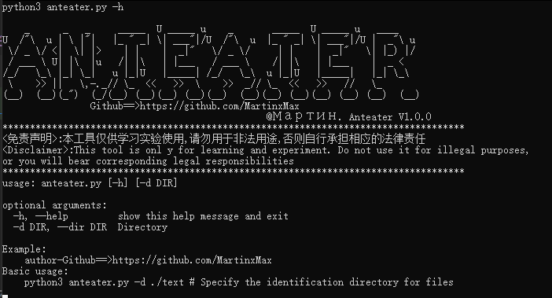
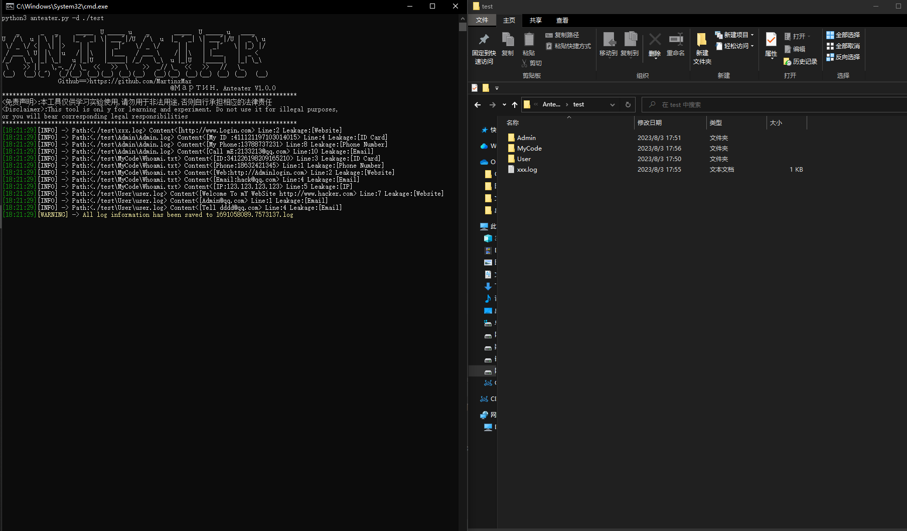
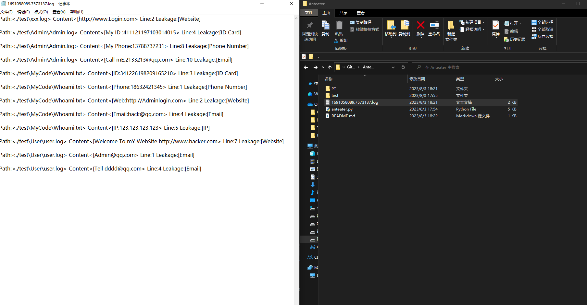

  

 
 
  
 
 

 

 
   
 <table>
  <tr>
      <th>Function</th>
  </tr>
  <tr>
    <th>Obtain sensitive information under the directory</th>

</tr>
 
 </table>

  
## Anteater Example

``#python3 anteater.py -h``

 

## Anteater Obtaining sensitive information

``#python3 anteater.py -d ./test``

 

 
